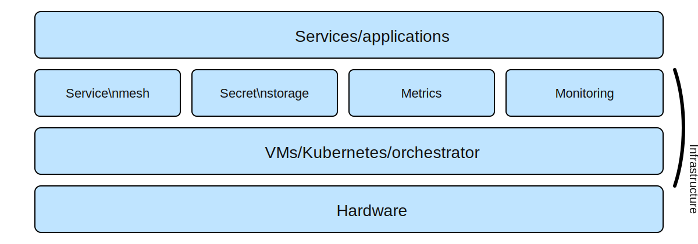

# Service mesh 101 - Notes

This is a short note that includes the service stack diagram.

Caption: high-level stack showing services/applications, service mesh, secret storage, metrics, monitoring, VMs/Kubernetes/orchestrator, and hardware (infrastructure).
